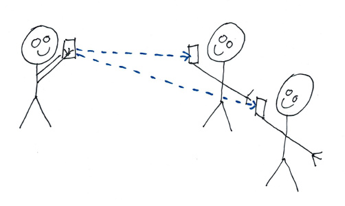
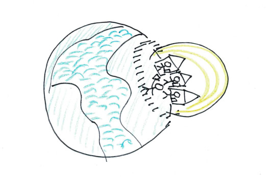
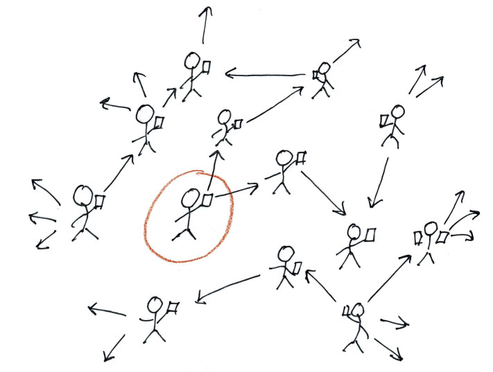
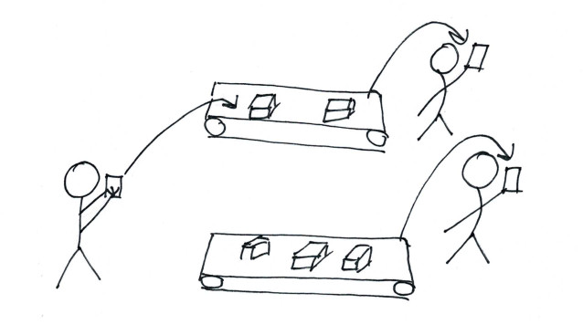
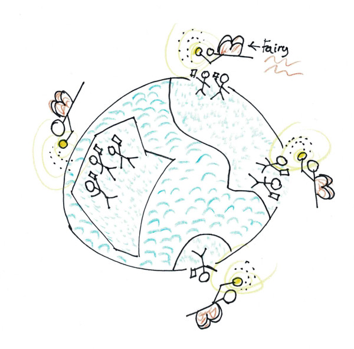

# How to make make your own twitter in 5 days

If you think about making your own twitterish app, you will soon stumble upon some quite interesting challenges. 

A twitterish app will allow anyone to sign up, tweet, and then to follow people and see their tweets. 

The feature _Signing up_ require some kind of database to store the users. If this is just for your closest friends or a few thousand tweeters, sqlite will be fine. 

Of course, you also need some back-end to handle the sign-ups and talk with the database. You could use a LAMP stack, ruby on rails or roller-skates, or nodejs or whatever. It doesn't really matter. Unless -if you want your app to be scalable, you may want to make the back-end a stateless micro-service that talk with a stateful database like MariaDB, Postgres or MongoDB - each of witch can be scaled up if you put some effort into it.

Once signed up, your users must have a way to become followers. In other words; they need a way to discover other users. That means that our app must have some search functionality. So - when someone signs up, they could search for their friends, or people with similar interest (or opposite interests for the evangelists). What about other local users? How cool would it be to be able to find and follow people in your own village or neighborhood!?! Or in the same coffee shop or nightclub?

Since all internet connected devices has some kind of location awareness (so that advertisers can feed us the _most relevant ads_), how about exploiting that to locate nearby people? Getting your location off your device is trivial. But a simple database like sqlite has no Geo-location awareness. So we need a database that knows about Geo-locations to implement that feature. A proper Geo-location aware database should allow us to directly query for the _n_ closest entities of any Geo-location (latitude, longitude) in the world.

Another way to find followers is to see who the people we follow, follows. That can be implemented using a traditional SQL database - to a certain extent. If we want to walk several levels into the followers followers followers, we are really in the realm of a graph database. A graph database tracks relations between objects, and allow us to make simple and fast queries to traverse the graph to fetch whatever objects we desire. 

But the most important feature of them all is to make sure all our followers gets our tweets immediately. Not like Google Chat or Skype, that may take days to push a message notification. When we have something on our tongue, we want people to get it immediately, so that they can react to it (read: _Like it!_)

The traditional way to implement a thing like this, using web technology, is polling. The client polls every second to see if any of the people it follows has sent any new messages. That's fine on a residential Internet connection with a PC - but not so much on a phone, where you pay for the traffic and where traffic drains the battery. Not to talk about the back-end. If you make your twitter for your friends, you just need one micro-service instance with nodejs, 5 with ruby or 42 with Java, to serve 20 friends. If, on the other end, your app goes viral, you have a real challenge. One million users, each polling each second, will be rather expensive to handle as you will need thousands of micro-services. A better approach is to push the messages to the device. That can be accomplished with grpc, push notifications, or just plain old web-sockets.

In a micro-service architecture, one way to handle pushing messages in real time to the clients is a pub-sub service. Think of it as queues or persistent streams, where each user has a personal queue or a stream she subscribes to. When someone publishes a message, the back-end copies the message to the queue or stream for each of her subscribers. As soon as the message is pushed to a queue or stream, the pub-sub service checks if the subscriber is connected, and immediately send the message to those who are. Those who are off-line will get the messages as soon as they connect to their queue or stream. 

So. For our twitterish app, we need a trivial database for the users, a Geo-location database, a graph database, and some kind of pub-sub service for the notifications. That's 4 stateful technologies that our stateless micro-service have to deal with (and we have to read up on, comprehend, deploy and talk with from the micro-service).

If the app goes viral, we also have to scale it from tens to thousands to millions of users. That's hard. Especially if our users are spread all around the world. If we deploy our gang of 4 in Central Europe, users from USA, India, China, Australia will get latency and connectivity issues. (Even Netflix and HBO are unable to serve a global user base in a timely manner. I often switch off my TV before either of them starts to play the movie I want to watch). If your app is slow, you loose users. It's that simple. 

So what if we could just make up some imaginary fairy technology that our stateless micro-service could connect to that would have low latency, scale to any size, and deal with the gang of 4 stateful technologies we require - from anywhere in the world? Then we could deploy our micro-services in Australia, in Asia, in Europe in USA, in UK - anywhere large clusters of users subscribed, and provide all of them with wonderful, reliable, low latency access to the latest fake news and trolling on the net? (Let's be realistic - if your app goes viral, all the bad people will be there - but so will all the good people, and we are the majority!). 

Well - good news. The "fairy" technology is coming! 

I have spent the last few months working on it, after joining a small team of dedicated, talented people in India, Europe and USA. When it went online with an early free preview a few weeks ago, I wanted to spend a weekend or two making an app that consumed all our main features - the gang of 4 - to get an idea about how easy or difficult it would be to actually use our service as a software architect and developer. So I made a simple app in Qt/QML that I called [_barker_](https://github.com/Macrometacorp/barker-demo) (I'm more a dog person then a bird person) using our document database (a basic key/value store where the values are Json documents) for users and messages (barks), the graph database (edges attached to Json documents) for relations (followers), the Geo-location index type (for the Json documents) for Geo-location, and streams over websockets to receive new messages in real time.

It took me 46 hours and 39 minutes to do this. About 1/3 of the time was spent on figuring out how to implement all the client functionality in QML (usually I use C++ for all the logic - but I wanted to learn something new - and if someone wants to use my code as an example, JavaScript is much simpler to understand for most people than C++), 1/3 was spent working around on bugs, figuring out undocumented features and tuning queries (don't worry - our documentation team and developers got a steady stream of feedback - so all that is/will be fixed), and 1/3 was spent on implementing the _thing_.

I ended up with a very simple stateless micro-service back-end in nodejs dealing with subscriptions to the service, login, distributing barks (what Twitter mistakenly refer to as _tweets_) and a few other things. 

I could have distributed the barks in the client, but if the client is shut off or loose connectivity in the process, some subscribers may not see the barks - which will be devastating for the barker, so it was better architecture to put it in the back-end .

For me this was an expedition into unknown technological territory. I have not used Geo-locations or graph databases in the past, and I have never designed a stateful, distributed application that's supposed to scale to any size just by deploying more back-end resources. 

I did not make it secure, as I would have done with a real app. But that was a trade off for simplicity - I wanted the client to connect directly to the database API for as many things as possible, and only use the micro-service where it is really needed. That of course means that the clients user credentials needs access to the actual databases, and this blows away pretty much all potential security. For example, if the user can write to the locations database to update her own location, she can also (by modifying the app or call the API with curl) change anyone else location.

The Macrometa Cloud is designed to offload the burden of the scaling stateful components (the databases and the streams) from the applications architecture and 'just work'. The service allows you to enable local endpoints all around the world just by clicking on a map in a dashboard. Then you can use Geo DNS to allow your users to connect directly to the nearest endpoint of your database, or deploy micro-services in the same or close-by data-centers to handle the local users. Your document collections and streams are instantly replicated to all the geographic regions you enable. For a software architect or developer - using the database or the streams from a mobile app, webapp or micro-service is just as simple as connecting to Postgres, MongoDB or Redis from your code. Just that you don't have to worry about deploying or scaling those components. It's just a near-by REST API endpoint (or web-sockets for the streams) with low latency and extra, cool features like Geo-location and graph queries. I was totally blown away by this technology when I first learned about it a few months back. For a software architect or app developer - it opens up a totally new dimension of opportunities. Just take my barker app as an example - In one week, I created a app that can scale to millions of users all over the word with just a few clicks in the Macrometa dashboard - without doing anything at all in my architecture or code to deal with that. 

Thank you for following me this far. Now - to prove that I am in fact a developer, and not some marketing guy or business person, I'll quote my update in today's Scrum call. 

- Boss: Did you start on the Big, Boring, Exhausting task I assigned to you?
- Me: No, today I drew fairies...

J. 
Software developer for 30+ years.

